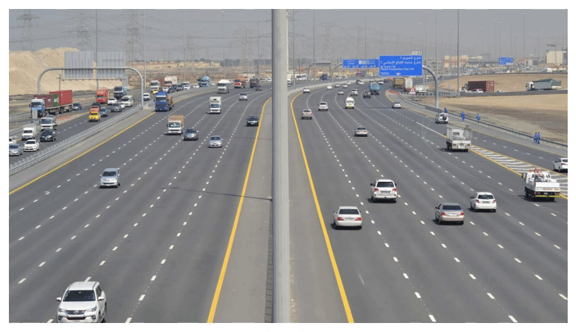
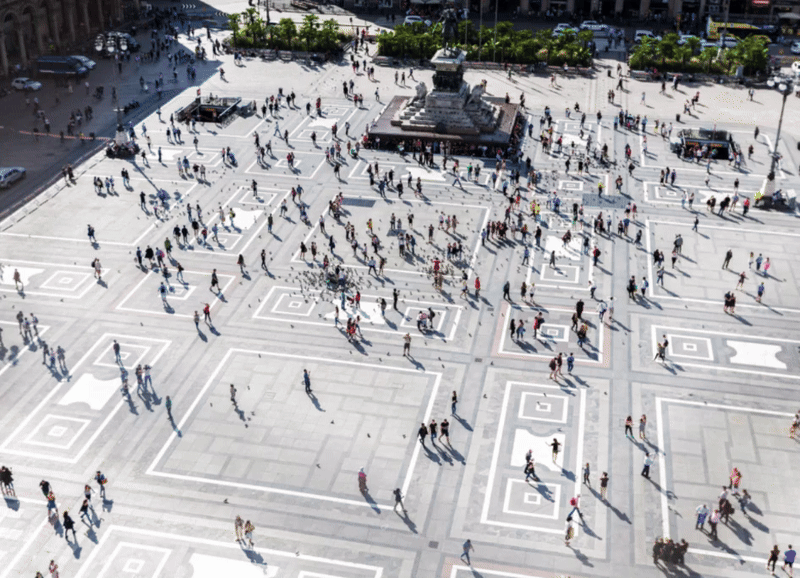

# YOLO-Patch-Based-Inference

This Python library simplifies SAHI-like inference for instance segmentation tasks, enabling the detection of small objects in images. It caters to both object detection and instance segmentation tasks, supporting a wide range of Ultralytics models. 

The library also provides a sleek customization of the visualization of the inference results for all models, both in the standard approach (direct network run) and the unique patch-based variant.

**Model Support**: The library offers support for multiple ultralytics deep learning [models](https://docs.ultralytics.com/models/), such as YOLOv8, YOLOv8-seg, YOLOv9, YOLOv9-seg, YOLOv10, FastSAM, and RTDETR. Users can select from pre-trained options or utilize custom-trained models to best meet their task requirements.

__Explanation of how Patch-Based-Inference works:__

<p align="center">
  
</p>

## Installation
You can install the library via pip:

```bash
pip install patched_yolo_infer
```

[](https://pypi.org/project/patched-yolo-infer/) - Click here to visit the PyPI page of `patched-yolo-infer`.

Note: If CUDA support is available, it's recommended to pre-install PyTorch with CUDA support before installing the library. Otherwise, the CPU version will be installed by default.

---

</details>

## Notebooks

Interactive notebooks are provided to showcase the functionality of the library. These notebooks cover batch-inference procedures for detection, instance segmentation, inference custom visualization, and more. Each notebook is paired with a tutorial on YouTube, making it easy to learn and implement features.


| **Topic** | **Notebook** | **YouTube** |
| ----- | -------- | ------- |
| [Patch-Based-Inference Example][nb_example1] | [![Open In Colab][colab_badge]][colab_ex1] |<div align="center">[][yt_link1] |
| [Example of custom visualization of usual inference results][nb_example2] | [![Open In Colab][colab_badge]][colab_ex2] | <div align="center">[][yt_link2] |


For Russian users, there is a detailed video presentation of this project. YouTube video in Russian is available at this [__link__](https://youtu.be/ihch6pIZtQg).

---
## Examples:

#### Detection example:


#### Instance Segmentation example 1:


#### Instance Segmentation example 2:


---
## Usage

### 1. Patch-Based-Inference
To carry out patch-based inference of YOLO models using our library, you need to follow a sequential procedure. First, you create an instance of the `MakeCropsDetectThem` class, providing all desired parameters related to YOLO inference and the patch segmentation principle.<br/> Subsequently, you pass the obtained object of this class to `CombineDetections`, which facilitates the consolidation of all predictions from each overlapping crop, followed by intelligent suppression of duplicates. <br/>Upon completion, you receive the result, from which you can extract the desired outcome of frame processing.

The output obtained from the process includes several attributes that can be leveraged for further analysis or visualization:

1. img: This attribute contains the original image on which the inference was performed. It provides context for the detected objects.

2. confidences: This attribute holds the confidence scores associated with each detected object. These scores indicate the model's confidence level in the accuracy of its predictions.

3. boxes: These bounding boxes are represented as a list of lists, where each list contains four values: [x_min, y_min, x_max, y_max]. These values correspond to the coordinates of the top-left and bottom-right corners of each bounding box.

4. polygons: If available, this attribute provides a list containing NumPy arrays of polygon coordinates that represent segmentation masks corresponding to the detected objects. These polygons can be utilized to accurately outline the boundaries of each object.

5. classes_ids: This attribute contains the class IDs assigned to each detected object. These IDs correspond to specific object classes defined during the model training phase.

6. classes_names: These are the human-readable names corresponding to the class IDs. They provide semantic labels for the detected objects, making the results easier to interpret.

```python
import cv2
from patched_yolo_infer import MakeCropsDetectThem, CombineDetections

# Load the image 
img_path = 'test_image.jpg'
img = cv2.imread(img_path)

element_crops = MakeCropsDetectThem(
    image=img,
    model_path="yolov8m.pt",
    segment=False,
    shape_x=640,
    shape_y=640,
    overlap_x=50,
    overlap_y=50,
    conf=0.5,
    iou=0.7,
    resize_initial_size=True,
)
result = CombineDetections(element_crops, nms_threshold=0.25)  

# Final Results:
img=result.image
confidences=result.filtered_confidences
boxes=result.filtered_boxes
polygons=result.filtered_polygons
classes_ids=result.filtered_classes_id
classes_names=result.filtered_classes_names
```

#### Explanation of possible input arguments:

**MakeCropsDetectThem**
Class implementing cropping and passing crops through a neural network for detection/segmentation:

| **Argument**          | **Type**               | **Default**  | **Description**                                                                                                |
|-----------------------|------------------------|--------------|----------------------------------------------------------------------------------------------------------------|
| image                 | np.ndarray             |              | Input image BGR.                                                                                               |
| model_path            | str                    | "yolov8m.pt" | Path to the YOLO model.                                                                                        |
| model                 | ultralytics model      | None         | Pre-initialized model object. If provided, the model will be used directly instead of loading from model_path. |
| imgsz                 | int                    | 640          | Size of the input image for inference YOLO.                                                                    |
| conf                  | float                  | 0.5          | Confidence threshold for detections YOLO.                                                                      |
| iou                   | float                  | 0.7          | IoU threshold for non-maximum suppression YOLOv8 of single  crop.                                              |
| classes_list          | List[int] or None      | None         | List of classes to filter detections. If None, all classes are considered.                                     |
| segment               | bool                   | False        | Whether to perform segmentation (if the model supports it).                                                    |
| shape_x               | int                    | 700          | Size of the crop in the x-coordinate.                                                                          |
| shape_y               | int                    | 600          | Size of the crop in the y-coordinate.                                                                          |
| overlap_x             | float                  | 25           | Percentage of overlap along the x-axis.                                                                        |
| overlap_y             | float                  | 25           | Percentage of overlap along the y-axis.                                                                        |
| show_crops            | bool                   | False        | Whether to visualize the cropping.                                                                             |
| resize_initial_size   | bool                   | False        | Whether to resize the results to the original input image size (ps: slow operation).                           |
| memory_optimize       | bool                   | True         | Memory optimization option for segmentation (less accurate results when enabled).                              |
| inference_extra_args  | dict                   | None         | Dictionary with extra ultralytics [inference parameters](https://docs.ultralytics.com/modes/predict/#inference-arguments) (possible keys: half, device, max_det, augment, agnostic_nms and retina_masks) |
| batch_inference       | bool                   | False        | Batch inference of image crops through a neural network instead of sequential passes of crops (ps: faster inference, higher gpu memory use).                           |


**CombineDetections**
Class implementing combining masks/boxes from multiple crops + NMS (Non-Maximum Suppression):

| **Argument**         | **Type**          | **Default** | **Description**                                                                                                         |
|----------------------|-------------------|-------------|-------------------------------------------------------------------------------------------------------------------------|
| element_crops        |MakeCropsDetectThem|             | Object containing crop information.                                                                                     |
| nms_threshold        | float             | 0.3         | IoU/IoS threshold for non-maximum suppression. The lower the value, the fewer objects remain after suppression.                                                                          |
| match_metric         | str               | IOS         | Matching metric, either 'IOU' or 'IOS'.                                                                                 |
| intelligent_sorter   | bool              | True        | Enable sorting by area and rounded confidence parameter. If False, sorting will be done only by confidence (usual nms). |
| sorter_bins          | int               | 10          | Number of bins to use for intelligent_sorter. A smaller number of bins makes the NMS more reliant on object sizes rather than confidence scores. |


---
### 2. Custom inference visualization:
Visualizes results of patch-based object detection or segmentation on an image.\
Possible arguments of the ```visualize_results``` function:

| Argument                | Type            | Default       | Description                                                                                   |
|-------------------------|-----------------|-----------    |-----------------------------------------------------------------------------------------------|
| img                     | numpy.ndarray   |               | The input image in BGR format.                                                                |
| boxes                   | list            |               | A list of bounding boxes in the format [x_min, y_min, x_max, y_max].                          |
| classes_ids             | list            |               | A list of class IDs for each detection.                                                       |
| confidences             | list            | []            | A list of confidence scores corresponding to each bounding box.                               |
| classes_names           | list            | []            | A list of class names corresponding to the class IDs.                                         |
| polygons                | list            | []            | A list containing NumPy arrays of polygon coordinates that represent segmentation masks.      |
| masks                   | list            | []            | A list of segmentation binary masks.                                                          |
| segment                 | bool            | False         | Whether to perform instance segmentation visualization.                                       |
| show_boxes              | bool            | True          | Whether to show bounding boxes.                                                               |
| show_class              | bool            | True          | Whether to show class labels.                                                                 |
| fill_mask               | bool            | False         | Whether to fill the segmented regions with color.                                             |
| alpha                   | float           | 0.3           | The transparency of filled masks.                                                             |
| color_class_background  | tuple           | (0, 0, 255)   | The background BGR color for class labels.                                                    |
| color_class_text        | tuple           |(255, 255, 255)| The text color for class labels.                                                              |
| thickness               | int             | 4             | The thickness of bounding box and text.                                                       |
| font                    | cv2.font        |cv2.FONT_HERSHEY_SIMPLEX | The font type for class labels.                                                     |
| font_scale              | float           | 1.5           | The scale factor for font size.                                                               |
| delta_colors            | int             | seed=0        | The random seed offset for color variation.                                                   |
| dpi                     | int             | 150           | Final visualization size (plot is bigger when dpi is higher).                                 |
| random_object_colors    | bool            | False         | If true, colors for each object are selected randomly.                                        |
| show_confidences        | bool            | False         | If true and show_class=True, confidences near class are visualized.                           |
| axis_off                | bool            | True          | If true, axis is turned off in the final visualization.                                       |
| show_classes_list       | list            | []            | If empty, visualize all classes. Otherwise, visualize only classes in the list.              |
| list_of_class_colors      | list      | None         | A list of tuples representing the colors for each class in BGR format. If provided, these colors will be used for displaying the classes instead of random colors. |
| return_image_array      | bool            | False         | If True, the function returns the image (BGR np.array) instead of displaying it.              |


Example of using:
```python
from patched_yolo_infer import visualize_results

# Assuming result is an instance of the CombineDetections class
result = CombineDetections(...) 

# Visualizing the results using the visualize_results function
visualize_results(
    img=result.image,
    confidences=result.filtered_confidences,
    boxes=result.filtered_boxes,
    polygons=result.filtered_polygons,
    classes_ids=result.filtered_classes_id,
    classes_names=result.filtered_classes_names,
    segment=False,
)
```

---
## Tips for achieving the best Patch-Based-Inference results

1. **Optimal Crop Size and Overlap**: Ensuring high-quality results involves carefully selecting the size of crops (patches) and their overlap. It is advisable not to create an excessive number of crops, and to set the overlap between 15% to 40%.

2. **Visualizing Crops**: To review the crops generated, set `show_crops=True` during the initialization of the `MakeCropsDetectThem` element. This will display the number of patches and an image showing how these patches look based on your initialized parameters (`shape_x`, `shape_y`, `overlap_x`, and `overlap_y`).

3. **Crop Size Considerations**: The size of each crop must exceed the size of the largest object intended to be detected in the image. Otherwise, the object may not be detected.

4. **Enhancing Detection Within Patches**: To detect more objects within a single crop, increase the `imgsz` parameter and lower the confidence threshold (`conf`). All parameters available for configuring Ultralytics model inference are also accessible during the initialization of the `MakeCropsDetectThem` element.

5. **Handling Duplicate Suppression Issues**: If you encounter issues with duplicate suppression from overlapping patches, consider adjusting the `nms_threshold` and `sorter_bins` parameters in `CombineDetections` or modifying the overlap and size parameters of the patches themselves. (PS: often lowering `sorter_bins` to 5 or 4 can help).

6. **Handling Multi-Class Detection Issues**: If you are working on a multi-class detection or instance segmentation task, it may be beneficial to switch the mode to `class_agnostic_nms=False` in the `CombineDetections` parameters. The traditional mode, `class_agnostic_nms=True`, is effective primarily when dealing with a vast number of closely related classes in pre-trained YOLO networks (for example, when there is often confusion between classes like `car` and `truck`). If in your scenario, an object of one class can physically be inside an object of another class, you should definitely set `class_agnostic_nms=False` for such cases.

7. **High-Quality Instance Segmentation**: For tasks requiring high-quality results in instance segmentation, detailed guidance is provided in the next section of the README.
---

## __How to improve the quality of the algorithm for the task of instance segmentation:__

In this approach, all operations under the hood are performed on binary masks of recognized objects. Storing these masks consumes a lot of memory, so this method requires more RAM and slightly more processing time. However, the accuracy of recognition significantly improves, which is especially noticeable in cases where there are many objects of different sizes and they are densely packed. Therefore, we recommend using this approach in production if accuracy is important and not speed, and if your computational resources allow storing hundreds of binary masks in RAM.

The difference in the approach to using the function lies in specifying the parameter ```memory_optimize=False``` in the ```MakeCropsDetectThem``` class.
In such a case, the informative values after processing will be the following:

1. img: This attribute contains the original image on which the inference was performed. It provides context for the detected objects.

2. confidences: This attribute holds the confidence scores associated with each detected object. These scores indicate the model's confidence level in the accuracy of its predictions.

3. boxes: These bounding boxes are represented as a list of lists, where each list contains four values: [x_min, y_min, x_max, y_max]. These values correspond to the coordinates of the top-left and bottom-right corners of each bounding box.

4. masks: This attribute provides segmentation binary masks corresponding to the detected objects. These masks can be used to precisely delineate object boundaries.

5. classes_ids: This attribute contains the class IDs assigned to each detected object. These IDs correspond to specific object classes defined during the model training phase.

6. classes_names: These are the human-readable names corresponding to the class IDs. They provide semantic labels for the detected objects, making the results easier to interpret.


Here's how you can obtain them:
```python
img=result.image
confidences=result.filtered_confidences
boxes=result.filtered_boxes
masks=result.filtered_masks
classes_ids=result.filtered_classes_id
classes_names=result.filtered_classes_names
```

An example of working with this mode is presented in Google Colab notebook - [![Open In Colab][colab_badge]][colab_ex1_memory_optimize]

[nb_example1]: https://nbviewer.org/github/Koldim2001/YOLO-Patch-Based-Inference/blob/main/examples/example_patch_based_inference.ipynb
[colab_badge]: https://colab.research.google.com/assets/colab-badge.svg
[colab_ex1]: https://colab.research.google.com/drive/1XCpIYLMFEmGSO0XCOkSD7CcD9SFHSJPA?usp=sharing
[yt_link1]: https://www.youtube.com/watch?v=kMfzWd8GK5Y
[nb_example2]: https://nbviewer.org/github/Koldim2001/YOLO-Patch-Based-Inference/blob/main/examples/example_extra_functions.ipynb
[colab_ex2]: https://colab.research.google.com/drive/1eM4o1e0AUQrS1mLDpcgK9HKInWEvnaMn?usp=sharing
[yt_link2]: https://www.youtube.com/watch?v=nBQuWa63188
[colab_ex1_memory_optimize]: https://colab.research.google.com/drive/1XCpIYLMFEmGSO0XCOkSD7CcD9SFHSJPA?usp=sharing#scrollTo=DM_eCc3yXzXW
